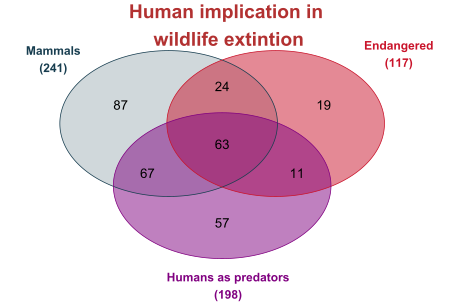
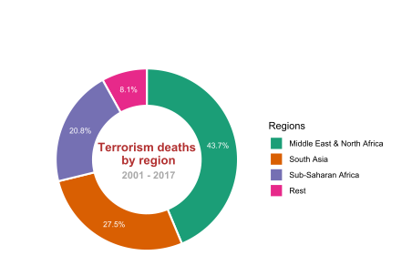

## PEC 2 - Visualización de datos
 
### Pie chart

Data source: [Global Terrorism Dataset](https://www.kaggle.com/muhammetvarl/global-terrorism)

### Venn Diagram

Data source: [Animals Descriptions Dataset](https://www.bing.com/search?q=animals+descriptions+dataset&cvid=4f9a7bb515e54b21b208a0681ac9bf3f&aqs=edge..69i57.11103j0j4&PC=NMTS&first=9&FORM=PERE)

### Rain Cloud Plot

Data source: [Diabetes Dataset](https://www.kaggle.com/pritsheta/diabetes-dataset)
