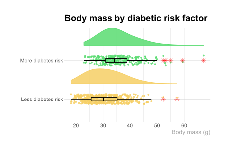

## PEC 2 - Visualización de datos

### Alexander Almendral González

Link de la visualización: [https://mralmonds.github.io/DataVisualization/](https://mralmonds.github.io/DataVisualization/) 
 
### Pie chart de Global Terrorism Dataset

Data source: [https://www.kaggle.com/muhammetvarl/global-terrorism](https://www.kaggle.com/muhammetvarl/global-terrorism)
- 181691 filas y 135 variables
- Variable categórica: región
- Variable numérica: número de asesinatos
- Límite de categorías a mostrar. Top 4 regiones del mundo con más asesinatos por terrorismo

### Venn Diagram de Animals Descriptions Dataset

Data source: [https://github.com/EmilHvitfeldt/animals](https://github.com/EmilHvitfeldt/animals)

- 610 filas y 48 variables
- Variables categóricas
- Límite de conjuntos a mostrar.

### Rain Cloud Plot de Diabetes Dataset
Data source: [https://www.kaggle.com/pritsheta/diabetes-dataset](https://www.kaggle.com/pritsheta/diabetes-dataset)

- 768 filas y 9 variables
- Variable categórica: riesgo de diabetes
- Variable numérica: masa corporal (g)
- Límite de categorías a mostrar.

